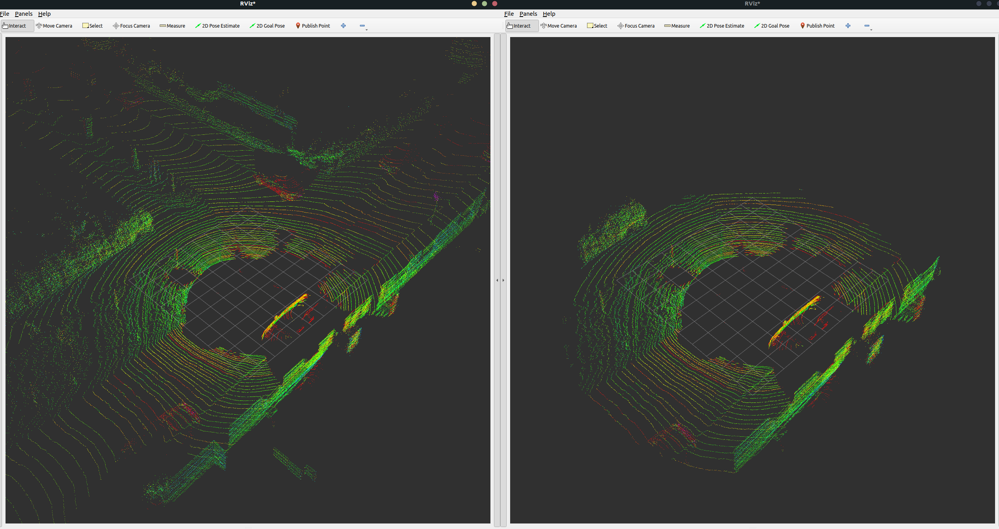
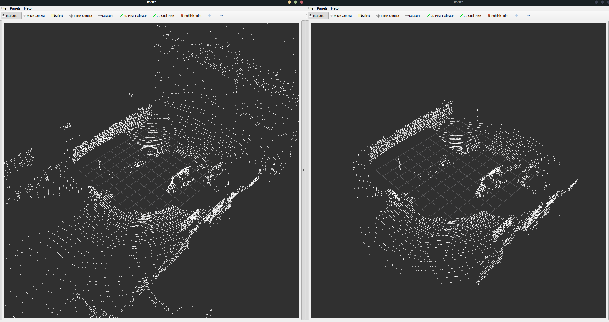

# Basic_ROS2_LiDAR

The "lidar_processing" package provides a basic ROS 2 node for processing LiDAR point cloud data.

## Features

- Subscribes to a given topic to receive LiDAR data.
- Converts ROS 2 PointCloud2 messages to Open3D point clouds (2 possibilities: convert only xyz coords, or all the fields. Check the available functions in `src/point_cloud_utils.py`).
- Filters points based on a configurable distance threshold.
- Publishes the filtered point cloud to /filtered_pointcloud topic.
- Provides configurable parameters for real-time constraints, debugging, 
  distance filtering, and topic/frame_id selection.

## Code Structure

    lidar_processing/
    ├── __init__.py               # Exposes module components
    ├── lidar_node.py             # Main node for processing point clouds
    ├── main.py                   # Entry point to start the ROS2 node
    ├── point_cloud_utils.py      # Utility functions for point cloud conversions

## Requirements

- [ROS 2 Humble](https://docs.ros.org/en/humble/Installation.html)
- Open3D
- NumPy
- sensor_msgs_py

        pip install numpy open3d sensor_msgs_py 

    
## Compilation

After cloning the repo in a desired location:

    cd Basic_ROS2_LiDAR/ros2_ws
    colcon build
    source install/setup.bash

## **Configurable Parameters**

| Parameter              | Default Value        | Description |
|------------------------|---------------------|-------------|
| `real_time_constraint` | `0.1` s           | Maximum allowed processing time per message. |
| `debug_mode`           | `False`             | Enables debug logs with processing times. |
| `input_topic`          | `/velodyne_points`  | Topic name for incoming LiDAR point clouds. |
| `frame_id`             | `velodyne`          | Frame ID for incoming LiDAR point clouds. |
| `distance_threshold`   | `10.0` meters       | Maximum distance from the origin to keep points. |

A launch file (`lidar_processing.launch.py`) is provided to start the node with desired parameters.

To check the topic name or the frame_id of your rosbag, use the following commands:

    # Topic name
    ros2 bag info [bag_file]

    # Frame ID (while running the rosbag):
    ros2 topic echo /[topic_name]

## Execution

    # Terminal 1 (program)
    ros2 launch lidar_processing lidar_processor_launch.py

    # Terminal 2 (dataset)
    ros2 bag play <bag_file_path> [--loop]

    # Terminal 3 (visualization)
    rviz2

## Checking Real-Time Performance

- Use debug_mode (`'debug_mode': True` in `launch/lidar_processor_launch.py`)
- With debugging enabled, the node will print timing information. If the total processing time exceeds `real_time_constraint`, a warning is issued.
    - Real-time performance evaluation:
        - If processing time ≤ frame interval (1 / Message Frequency), the algorithm meets real-time.
        - If processing time > frame interval (1 / Message Frequency), it may cause delays or frame drops.

### Checking the sensor/rosbag message frequency 

    ros2 topic hz /[topic_name]

\
    Output example (~10MHz):

        average rate: 9.705
        min: 0.091s max: 0.109s std dev: 0.00513s window: 11
        [...]

## Demo
Results of the LiDAR filtering process: original point cloud (left) vs filtered by distance point cloud (right).

Tested with:
- OS: Ubuntu 22.04 LTS.
- Python: v3.10.12
- Dataset: [KITTI](https://www.cvlibs.net/datasets/kitti/).

### Intensity view

### XYZ View 

\*NOTE: Depending on the application, converting only the 3D coordinates can be very convenient. Native Python conversions are very costly and will impact the ability to meet real-time processing constraints.  Using C++ bindings for this task can significantly improve performance. Other techniques that can be used when working with Python include avoiding loops, using optimized libraries, or downsampling the point cloud if maximum precision is not a strict requirement.

## Maintainer

Silvia R. Alcaraz (@silviaralcaraz)

